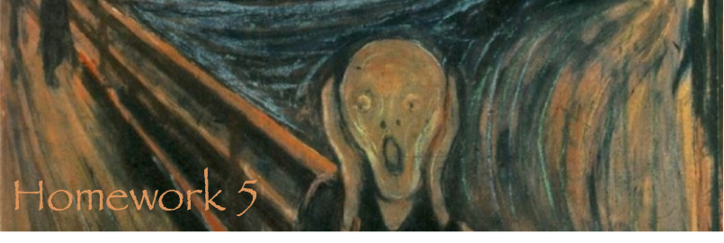

===

This homework is about bird migration and social media analysis. In the first problem we investigate potential risk for human clothes and the impact of bird droppings on weather changes. The Second Problem focuses on social media analysis.

Find more information on both topics [here](http://en.wikipedia.org/wiki/April_Fools'_Day).
  
  
  
  
Problem 1 - Bird Migration
====
We see them everyday - bird droppings on cars, windows, benches, and if unlucky, on our own clothes. However, did you know that these droppings emit O3? In fact, the ozone's slow rate in depletion is largely attributed to birds' fecal matter. 
For this homework, your goal is to save planet earth from ultraviolet rays. By gathering the data needed, you will build a visualization of the world, which will communicate where we have a shortage of birds. 

Tasks
--------

1.	Build a map of earth with an circurectangular projection. 
- Droppings should be aggregated by flock, and should be filter-able based on the four seasons. Adjust for seasonal migration so as not to double count the same flock. 
- Clicking on a flock should show a population of birds scattered. The scattering should be handled by a neural network algorithm. 
- Clicking on a bird should show in a separate view, the projected paths that the dropping may fall through. For this, use linear regression based on the data set for that flock. 
- You should enable forecasting, by allowing the user to drag and drop the flocks from one area to another. This will help determine the effectiveness of possible relocations.  
  

Problem 2 - Social Media Analysis
===
This problem focusses on social media analysis and insights that can be gained when observing people in cafes or the internet.

Data Acquisition
----

For this problem's data set, you are to find at least 10 members of the course staff and take a picture with them and collect the following pieces of information:

- Their favorite color
- What they ate for lunch that day
- Their favorite Ke$ha song

**Hint:** If you are a distance student and unable to collect this data in person, please feel free to use social networking tools, such as MySpace, to reach out the course staff members.

Design Studio
----
For this portion of the assignment, you should create an interactive visualization that includes storytelling elements to portray any interested trends you find from viewing the data.  Please include at least 7 sketches and a description of the type of writing utensil that you used.  Please note that for this homework, and this homework only, we are encouraging the usage of 3D donut charts (eatable versions preffered).

Tasks
---
1. Do not implement your ideas.

Conclusion
===

Robert Olsen said: "If you can laugh together, you can work together."  In this sense, we wish you a successful HW4 and we wish us together with you great visualization projects for CS171.
